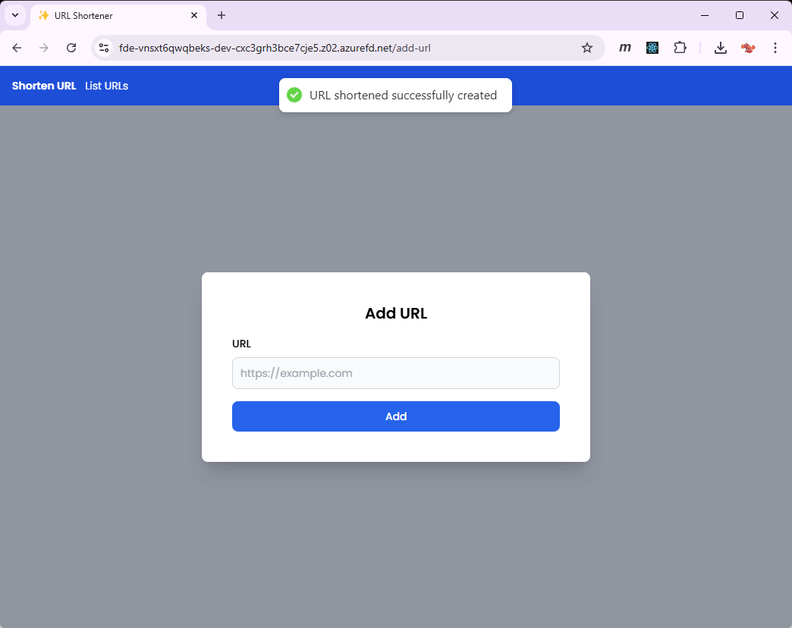
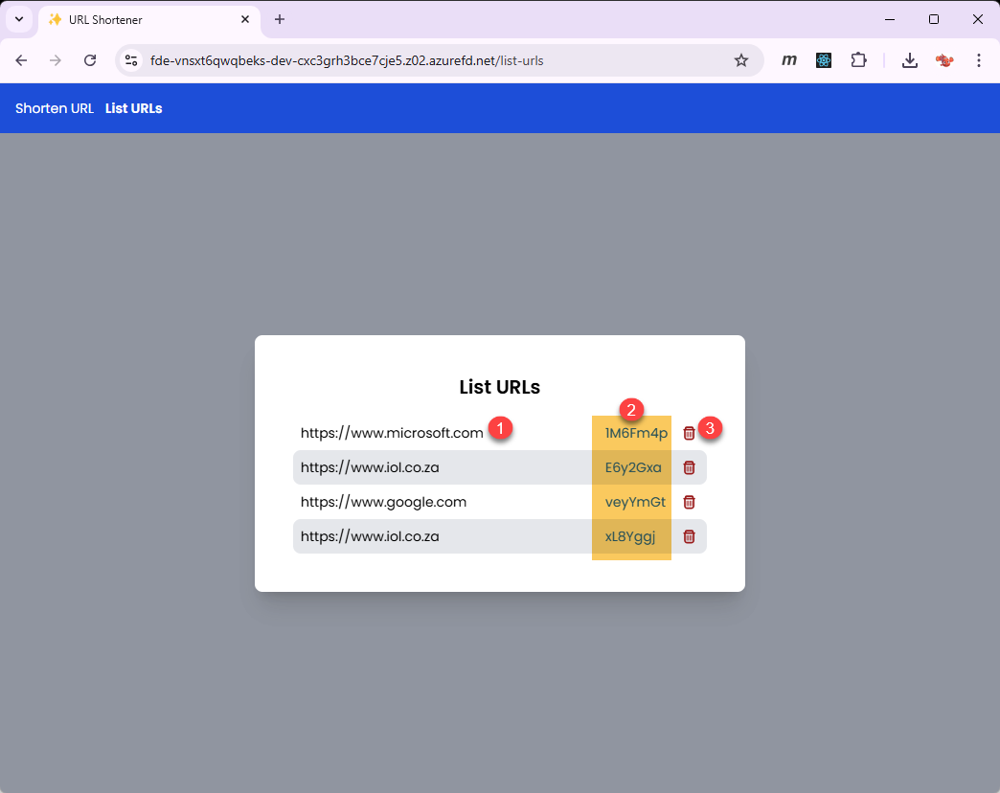
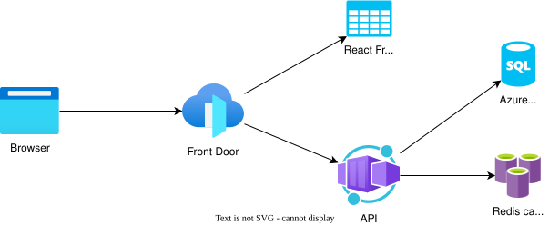
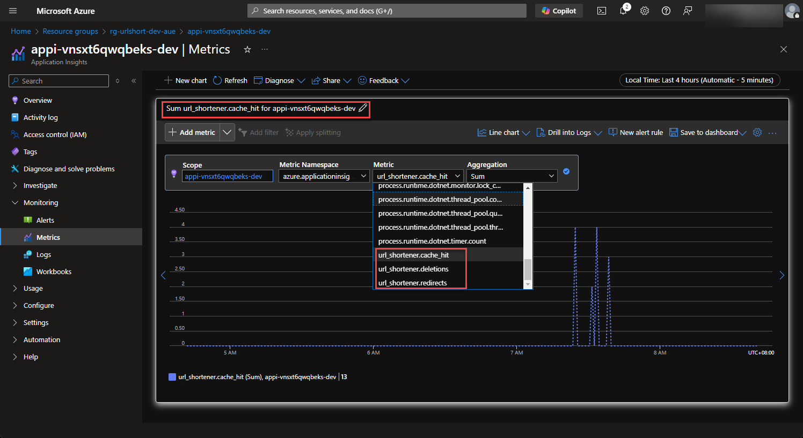

# URL Shortener

## Overview

I wanted to try out Aspire, so created this experiment of a URL shortener service fronted by a React SPA.

## UI walkthrough

A user is able to navigate to the site and add URL's to shorten via the `add-url` route shown below. The screenshot shows the instant that the URL was successfully added.

The list of URL's that have been saved are then accessible via the `list-urls` route. From this page, a user is able to click the short URL (marked 2 in screenshot below), which results in a new browser tab being opened issuing a request to the API for the original URL, which then results in a 302 HTTP response with the original URL to which the browser window is then redirected to.

The user is also able to delete short URLs from the list.

## Architecture

A high-level diagram of the Azure resources used to host the service and SPA. All requests are routed via Azure Front Door for both UI and API.

The API is configured to use OpenTelemetry, and the API records metrics based on certain interactions, which show up in AppInsights as shown below.

## Tech used

1. React (for the SPA frontend)
1. Tailwind CSS
1. Aspire
1. Bicep (IaC - infrastructure-as-code)
1. GitHub Git Repo & Actions
1. .NET 9
1. Azure (various resources)
